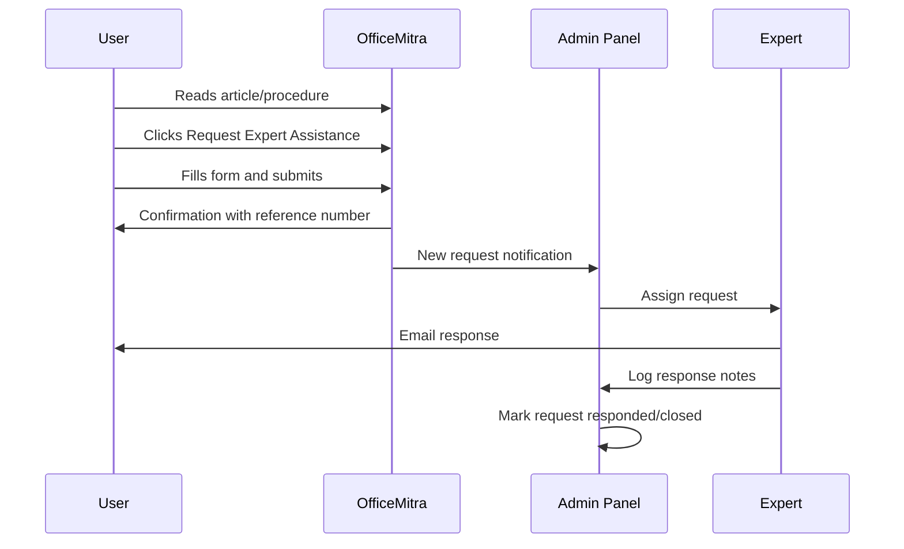

# Expert Assistance — V1 Specification

Expert Assistance is OfficeMitra's moat. It launches in V1 as a basic but fully working request-and-response workflow.

---

## Strategic Role

| Commodity (easy to copy) | Moat (hard to copy) |
|---|---|
| Search, articles, documents, templates | Practical Health Department administrative experience |

Content attracts visitors. Expert guidance converts trust and builds platform authority.

---

## V1 Scope

### In Scope

- Public request form
- Five service types
- Health Department institutions only
- On-screen confirmation with reference number
- Email notification to requester and admin
- Admin dashboard for request management
- Expert responds by email (no in-app messaging)
- Disclaimers on form and all responses

### Out of Scope (V2+)

- In-app messaging and request history
- Departments beyond Health
- Priority/paid tiers
- Automated or AI-assisted review
- File attachment preview in admin (download only in V1)

---

## Service Types

| Type | ID | Description |
|---|---|---|
| Draft Review | `draft_review` | Review proceedings, memos, notes, agreements for format and content |
| Rule Clarification | `rule_clarification` | Clarify applicable rules, GOs, or circulars for a specific case |
| Establishment Guidance | `establishment_guidance` | Guidance on promotion, probation, seniority, transfers, etc. |
| Finance Guidance | `finance_guidance` | Guidance on APGLI, GPF, bills, reimbursements, etc. |
| Document Review | `document_review` | Review completeness and correctness of case documents |

---

## Eligibility (V1)

**Health Department institutions in Andhra Pradesh only.**

Requesters must be government employees or staff working in:

- District hospitals
- Area hospitals
- Community health centres
- Primary health centres
- Department of Health offices
- Medical colleges under Health Department

Other departments: content is available; Expert Assistance opens in V2.

---

## Request Form Fields

| Field | Type | Required | Validation |
|---|---|---|---|
| Full Name | text | Yes | Min 2 characters |
| Designation | text | Yes | e.g. "Junior Assistant", "Superintendent" |
| Institution | text | Yes | Hospital or office name |
| Department | select | Yes | Health Department (only option in V1) |
| Email | email | Yes | Valid email for response |
| Phone | tel | No | 10-digit mobile |
| Service Type | select | Yes | One of five service types |
| Case Summary | textarea | Yes | Min 50 characters; describe the case clearly |
| Related Article | hidden/text | No | Pre-filled if linked from article/procedure |
| Attachment | file | No | PDF or DOCX, max 5 MB |

---

## User Journey

### Step-by-Step

1. User encounters a complex case while reading content
2. Clicks "Request Expert Assistance" (homepage banner, article footer, procedure footer, or `/expert-assistance` page)
3. Completes form with case details; optionally uploads draft
4. Receives on-screen confirmation:
   - Reference number (format: `OM-EA-YYYY-NNNNN`)
   - Expected response: 2–3 working days
   - Reminder to check email
5. Admin receives notification; assigns to expert
6. Expert reviews case and responds by email
7. Admin logs response in dashboard and marks request closed
8. Recurring topics inform new articles and procedures

---

## SLA

| Metric | V1 Target |
|---|---|
| Initial response | 2–3 working days |
| Complex draft review | Up to 5 working days (communicated in acknowledgment) |
| Hours | Monday–Friday, 10:00–17:00 IST |
| Acknowledgment | Immediate (on-screen + email) |

If SLA cannot be met, admin sends a holding email with revised timeline.

---

## Admin Workflow

### Request Statuses

| Status | Meaning |
|---|---|
| `pending` | Submitted, not yet assigned |
| `assigned` | Assigned to expert |
| `in_review` | Expert actively reviewing |
| `responded` | Email response sent |
| `closed` | Case complete |

### Admin Actions

- View all requests (filter by status, service type, date)
- Assign to expert
- Update status
- Add internal notes
- Log response summary (for content improvement)
- Export request list (CSV, V1.1)

---

## Disclaimers

### On Request Form (required checkbox)

> I understand that OfficeMitra Expert Assistance provides administrative guidance based on practical office experience. It is not legal advice and does not represent any government department. Guidance is specific to the information I provide and may not cover all aspects of my case.

### In Acknowledgment Email

> Your request (Reference: OM-EA-YYYY-NNNNN) has been received. We aim to respond within 2–3 working days. OfficeMitra provides administrative guidance, not legal advice. Do not share passwords or unrelated personal information.

### In Expert Response Email

> This guidance is based on administrative practice and the information you provided. It is not a legal opinion or official government direction. For disputed or legally complex matters, consult your controlling officer or legal cell.

---

## Privacy and Data Retention

| Data | Policy |
|---|---|
| Case details | Confidential; accessible only to admin and assigned expert |
| Attachments | Stored securely; deleted 12 months after case closure |
| Request metadata | Retained for analytics; PII anonymized after 24 months |
| Email addresses | Used only for request communication; not shared or sold |

---

## Placement in UI

Expert Assistance CTA appears on:

- Homepage hero banner: "Need Professional Guidance? Request Expert Assistance"
- Every Knowledge Hub article footer
- Every Procedure Guide footer
- Dedicated page: `/expert-assistance`
- Navigation menu item

Pre-fill `related_article_slug` when user clicks CTA from a specific article or procedure.

---

## Success Metrics (V1)

| Metric | Purpose |
|---|---|
| Requests per week | Demand signal |
| Average response time | SLA compliance |
| Repeat requesters | Trust signal |
| Topics driving requests | Content roadmap input |
| Requests converted to articles | Content flywheel |

---

*See also: [MODULES](MODULES.md) · [POSITIONING](POSITIONING.md) · [CONTENT-MODEL](CONTENT-MODEL.md)*
