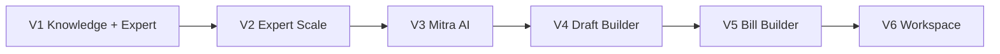

# OfficeMitra Roadmap

## Overview

OfficeMitra ships in six major versions. V1 combines the Knowledge Platform with Expert Assistance — the feature competitors cannot replicate.

---

## V1 — Knowledge Platform + Expert Assistance

**Status:** Foundation complete; V1 scaffold in progress

**Goal:** Launch a credible, useful public platform that builds authority through content and live expert guidance.

### Deliverables

| Area | Deliverable |
|---|---|
| Homepage | Hero search, quick categories, latest updates, popular procedures, Expert Assistance banner |
| Knowledge Hub | Structured articles with full schema |
| Procedure Guides | Step-by-step workflows |
| Document Library | GOs, circulars, manuals — search, filter, download |
| Updates Centre | Curated change summaries (what changed, who is affected, action required) |
| Templates Library | Basic downloadable formats |
| Expert Assistance | Request form, confirmation flow, admin intake, email response |
| Admin Panel | Content publishing + expert request management |
| Search | Full-text search across articles, procedures, documents |

### Explicitly Out of V1

- Mitra AI
- Draft Builder, Bill Builder, Workspace Mode
- OfficeMitra Plus / payment infrastructure
- Automated draft review
- Priority queue tiers
- In-app messaging for Expert Assistance

### Launch Definition

Public site with working Expert Assistance request form — not a content-only beta.

---

## V2 — Expert Assistance Scale

**Goal:** Expand Expert Assistance beyond MVP.

### Deliverables

- In-app messaging and request history for users
- Expanded department coverage beyond Health Department institutions
- Improved admin workflow (assignment, status tracking, response templates)
- User accounts (optional login for request tracking)

---

## V3 — Mitra AI

**Goal:** AI-powered administrative guidance.

### Deliverables

- Mitra AI assistant on articles and procedures
- Responses include: relevant rules, GO references, procedure, checklist, draft guidance
- Semantic search across platform content
- Training signal from anonymized Expert Assistance query patterns

---

## V4 — Draft Builder

**Goal:** Structured drafting tools for common office documents.

### Deliverables

- Guided draft creation for proceedings, memos, notes, agreements
- Field validation against administrative conventions
- Export to Word/PDF

---

## V5 — Bill Builder

**Goal:** Finance workflow automation.

### Deliverables

- Bill preparation workflows
- Integration with treasury and finance procedures
- Validation against AP finance rules

---

## V6 — Workspace Mode

**Goal:** Full administrative workspace for daily office work.

### Deliverables

- Case tracking
- Document management
- Team collaboration
- Workflow tools

---

## Revenue Model Timeline

| Tier | V1 | V2+ |
|---|---|---|
| Free content (articles, procedures, updates, documents, basic templates) | Yes | Yes |
| Expert Assistance | Free (build authority) | Free; priority tier in Plus |
| OfficeMitra Plus | Not available | Draft Builder, advanced templates, premium AI, priority assistance |

---

## Success Criteria (12 Months)

| Metric | Target | Notes |
|---|---|---|
| Articles | 500+ | ~10/week publishing cadence |
| Documents | 1,000+ | Manual curation initially; GO ingestion automation later |
| Monthly visitors | 10,000+ | SEO + AP government employee channels |
| Expert requests | Track from V1 | Volume, response time, repeat users |
| Recognition | AP admin knowledge platform | Health Dept testimonials and word-of-mouth |

---

## Content Operations

### Publishing Cadence (Recommended)

- **Articles:** 2–3 per week at launch, scaling to 10/week
- **Updates:** Within 48 hours of major GO/circular release
- **Documents:** Batch uploads weekly
- **Expert Assistance:** Response within 2–3 working days (V1 SLA)

### Priority Sources

1. Expert Assistance requests (highest signal for new content)
2. Popular search queries with no matching article
3. Health Department establishment and finance procedures
4. AP-wide topics (APGLI, GPF, Leave, Treasury)

---

*See also: [VISION](VISION.md) · [MODULES](MODULES.md) · [SEED-CONTENT](SEED-CONTENT.md)*
