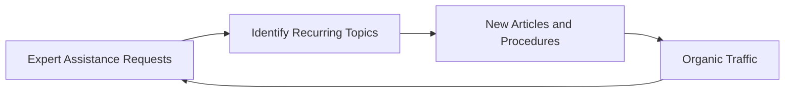

# OfficeMitra Seed Content

Launch content priorities for V1 — 20 flagship topics derived from Health Department administrative expertise, applicable across AP government departments.

Each topic should ship as a **Knowledge Hub article** and, where applicable, a **Procedure Guide** and **template**. All articles include an Expert Assistance CTA.

---

## Selection Criteria

1. High frequency in Health Department offices
2. Common audit objections or processing errors
3. Search demand from AP government employees
4. Cross-department relevance (not hospital-only)
5. Clear Expert Assistance value for complex cases

---

## Establishment (6 topics)

| # | Topic | Article | Procedure | Template | Priority |
|---|---|---|---|---|---|
| 1 | Probation Declaration | Yes | Yes | Proceedings | P0 — launch |
| 2 | Promotion — Zone/Category | Yes | Yes | Proceedings | P0 |
| 3 | Relinquishment of Promotion | Yes | Yes | Proceedings | P1 |
| 4 | Seniority — Fixation and Disputes | Yes | Yes | Note | P1 |
| 5 | Transfer — Inter-District | Yes | Yes | Proceedings | P1 |
| 6 | Service Register — Maintenance and Corrections | Yes | Yes | SR Entry | P0 |

---

## Finance (6 topics)

| # | Topic | Article | Procedure | Template | Priority |
|---|---|---|---|---|---|
| 7 | APGLI Loan — Application and Sanction | Yes | Yes | Application | P0 — launch |
| 8 | GPF Advance — Temporary and Non-Temporary | Yes | Yes | Application | P0 |
| 9 | GPF Final Withdrawal | Yes | Yes | Application | P1 |
| 10 | Medical Reimbursement — Processing | Yes | Yes | Bill format | P0 |
| 11 | Pay Fixation — After Promotion | Yes | Yes | Fixation order | P1 |
| 12 | DA / HRA Arrears — Calculation | Yes | Yes | — | P2 |

---

## Leave (3 topics)

| # | Topic | Article | Procedure | Template | Priority |
|---|---|---|---|---|---|
| 13 | EL — Encashment on Retirement | Yes | Yes | Application | P1 |
| 14 | Commuted Leave — Medical Grounds | Yes | Yes | Application | P1 |
| 15 | Maternity Leave — Rules and SR Entry | Yes | Yes | SR Entry | P2 |

---

## APGLI / GPF (2 topics)

| # | Topic | Article | Procedure | Template | Priority |
|---|---|---|---|---|---|
| 16 | APGLI Premium Deduction — Pay Bill Entry | Yes | Yes | — | P1 |
| 17 | GPF Nomination — Form and Processing | Yes | Yes | Nomination form | P2 |

---

## Treasury / Service Rules (3 topics)

| # | Topic | Article | Procedure | Template | Priority |
|---|---|---|---|---|---|
| 18 | Bill Submission — Treasury Procedure | Yes | Yes | Office note | P1 |
| 19 | New Pension Scheme — AP Rules Overview | Yes | No | — | P2 |
| 20 | Conduct Rules — Common Disciplinary Procedures | Yes | Yes | Charge memo | P2 |

---

## P0 Launch Set (Minimum Viable Content)

Ship these **8 topics** before public V1 launch:

1. Probation Declaration
2. Promotion — Zone/Category
3. Service Register — Maintenance and Corrections
4. APGLI Loan — Application and Sanction
5. GPF Advance — Temporary and Non-Temporary
6. Medical Reimbursement — Processing
7. EL — Encashment on Retirement *(or substitute P1 if time-constrained)*
8. Bill Submission — Treasury Procedure

Each P0 topic requires:

- [ ] Knowledge Hub article (full schema)
- [ ] Procedure Guide (where marked)
- [ ] Template file (where marked)
- [ ] At least one linked GO in Document Library
- [ ] Expert Assistance CTA enabled

---

## Supporting Documents (Launch)

Upload to Document Library alongside articles:

| Document | Linked Topics |
|---|---|
| AP Leave Rules (relevant GOs) | Leave topics |
| APGLI Scheme GOs | APGLI topics |
| GPF Rules GOs | GPF topics |
| Probation Rules GO | Probation Declaration |
| Medical Reimbursement Circular | Medical Reimbursement |

Target: **20 documents** at launch, scaling to 1,000+ within 12 months.

---

## Updates Centre (Launch)

Prepare 3–5 curated updates demonstrating the format:

1. Recent finance circular (APGLI or DA)
2. Recent establishment GO
3. Health Department specific circular (if available)
4. APPSC notification example

---

## Content Flywheel

Expert Assistance requests are the highest-priority signal for new content after launch.

---

## Cross-Linking Rules

Every article must link to:

- Related procedure (if exists)
- Related templates
- Source GOs in Document Library
- Expert Assistance page

Procedure guides must link back to parent article and forward to templates.

---

*See also: [CONTENT-MODEL](CONTENT-MODEL.md) · [MODULES](MODULES.md) · [ROADMAP](ROADMAP.md)*
